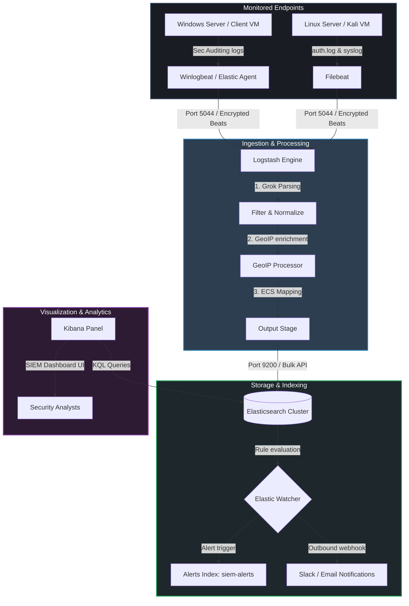

# SIEM Architecture Diagram & Log Flow

This document details the log ingestion pipeline and architecture for our Security Information and Event Management (SIEM) dashboard.

## Log Flow Architecture

The data pipeline follows a hierarchical flow from the edge systems to the central analyst visualization console.

## Component Breakdowns

### 1. Endpoint Logging Agents
- **Winlogbeat / Elastic Agent**: Installed on Windows systems. Configured to monitor the Security event log (focusing on Logon events 4624/4625 and Process Creation 4688).
- **Filebeat**: Installed on Linux endpoints. Monitored log paths:
  - `/var/log/auth.log` (Ubuntu/Debian) or `/var/log/secure` (CentOS/RHEL) for authentication attempts.
  - `/var/log/syslog` or `/var/log/messages` for system events.

### 2. Logstash Log Processing
- **Port 5044 Listener**: Ingests incoming Beats payloads securely.
- **Grok Parser**: Regular expression engine matching unstructured Linux system logs and converting them into structured attributes.
- **GeoIP Processor**: Interrogates public client IP fields using a GeoLite database, inserting latitude, longitude, and country configurations.
- **ECS Normalization**: Re-maps logs to the standardized **Elastic Common Schema (ECS)** format (e.g., source host IP becomes `source.ip`, process commands map to `process.command_line`).

### 3. Elasticsearch Storage Engine
- **Index Strategy**: Ingested events write to daily indexes `siem-logs-YYYY.MM.dd`.
- **Search Engine**: Index mappings use keyword types for filtering, IP types for CIDR range lookups, and geo-point types for map plotting.
- **Elastic Watcher**: Evaluates threshold triggers continuously (e.g. brute force triggers) and logs alert events to `siem-alerts` while issuing Webhook notifications.

### 4. Kibana Visualization Portal
- **Dashboard Interface**: Provides a dashboard containing maps, timeseries login timelines, threat rankings, and alert statistics.
- **Analyst Queries**: Supports near-real-time querying via Kibana Query Language (KQL) and Lucene queries.
